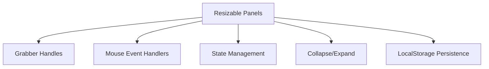
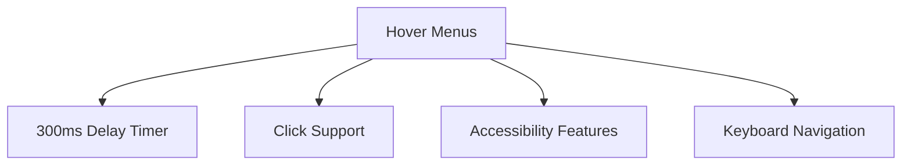

## UI Patterns

### GX Works2 IDE Interface Patterns

#### Dual Implementation Strategy
```mermaid
graph TD
    A[GX Works2 Interface] --> B[Complete Implementation]
    A --> C[Experimental Implementation]
    
    B --> D[GXWorks2IDE.tsx]
    B --> E[Full Features]
    B --> F[Production Ready]
    
    C --> G[GXWorks2StyleIDE.tsx]
    C --> H[@dnd-kit Integration]
    C --> I[Customizable Toolbars]
    C --> J[Experimental Features]
```

#### Resizable Panel Implementation


#### Hover Menu Implementation


### Implementation Details

#### Resizable Panels
1. **Grabber Handles**: Thin divs between panels that trigger resize
2. **Mouse Event Handlers**: Track mouse movement during resize
3. **State Management**: Store panel widths in component state
4. **Collapse/Expand**: Buttons to toggle panel visibility
5. **Persistence**: LocalStorage integration for user preferences

#### Hover Menus
1. **Timer-based**: 300ms delay for menu dismissal to prevent flickering
2. **Click Support**: Maintains click functionality for touch devices
3. **Accessibility**: ARIA attributes and keyboard navigation support
4. **Focus Management**: Proper focus states and tab navigation

#### Customizable Toolbars (@dnd-kit)
1. **Drag & Drop**: @dnd-kit library for smooth dragging
2. **State Management**: Zustand for layout persistence
3. **Group Organization**: Toolbar groups can be reorganized
4. **Cross-row Movement**: Support for moving groups between rows

### Example Code Patterns

#### Resizable Panel Structure
```jsx
<div className="flex w-full">
  <aside style={{ width: leftWidth }}>...</aside>
  <div 
    onMouseDown={startResize} 
    className="w-1 cursor-col-resize hover:bg-blue-200"
  />
  <main className="flex-1">...</main>
</div>
```

#### Hover Menu Implementation
```jsx
<div 
  onMouseEnter={() => {
    if (hoverTimer.current) clearTimeout(hoverTimer.current);
    setActiveMenu(menu);
  }}
  onMouseLeave={() => {
    hoverTimer.current = setTimeout(() => {
      setActiveMenu(null);
    }, 300);
  }}
>
  {/* Menu content */}
</div>
```

#### Zustand Store for Layout
```jsx
const useLayoutStore = create<LayoutState>((set) => ({
  rows: [],
  groups: defaultGroups,
  activeId: null,
  
  moveGroup: (sourceIndex, destinationIndex, rowId) => set(state => {
    // Implementation
  }),
  
  // Additional methods...
}));
```
